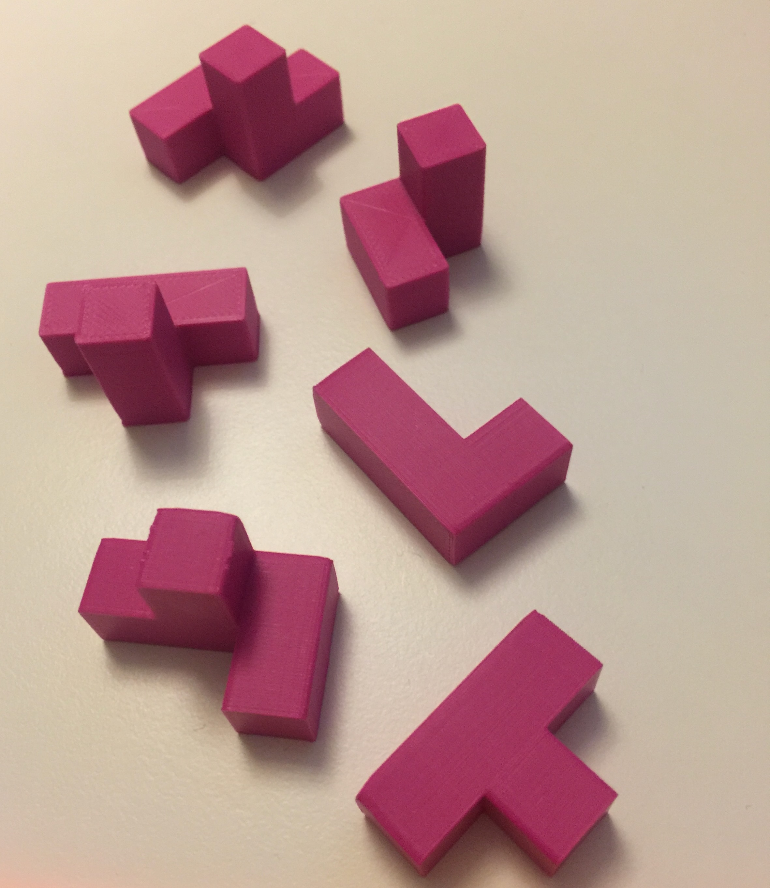

# A Python Solver for the Half-Hour Puzzle by Stewart Coffin
This here is a simple one-file Python script to solve the famous *Half Hour Puzzle* by Stewart Coffin. 

## The Story behind this Script
My brother had just bought a 3D printer and practiced printing different forms with it. He also found some 3D puzzles which he printed. One evening he showed us a few puzzles, most of them were a some elements that one needed to be combined into a cube. Anf for most of them we found a solution after playing around with them for a few minutes. 

But there was one that was not so simple to put together. The following picture shows the six elements of this puzzle. Only later I would learn that this was the well-known *Half Hour Puzzle* which was created by [Stewart Coffin](https://de.wikipedia.org/wiki/Stewart_Coffin), an award-winnig Amercian puzzle designer. 

Well, I was not able to solve it within half an hour and asked my brother if I could take it home to solve it later. After a few unsuccessful attempts at it I had the idea that this might be a fake and that it might be impossible to put togehter. That brought me to the idea to create a little script that would help me to find it out. At the time I also wanted to learn Python and used this as an opportunity. 

## The Puzzle Solver
This puzzle is solved with the simple Python script `HalfHour-Puzzle-Solver.py`. This script is neither pretty, nor well structure, has hardly any documentation, is not optimized for performance may it be speed or memory usage. But it does the job, it was fun to develop and it tought me a bit about programming in Python. 

I am quite sure you can simply copy and paste it into any Python environment and let it run there. 

## The Result 
The following lines are printed out to the console when the script finishes after only a few seconds. The solution is not immediately visible. Yet, I was very excited when I first saw this result for the first time, because until that point in time I did not solve the puzzle.   

`Yeah, hurray, we found a solution!!!
This is here is the solution: All 6 puzzle pieces fitted into a cube:

dba

dda

daa

bbb

ecf

dcf

eef

eff

ccc`

### How to interprete the Result
Each of the six elements is represented by a letter ("a" to "g"). As this cube is 3x3x3 you can see three blocks (let's say these are the levels from bottom to top) wich each three lines, each consisting of three letters which represent the 27 partials that the cube is constructe of. Let's take the element "a" which is called "el" in the script since it looks like the letter "L". The element "el" lays down in the bottom layer only and covers the right side of the bottom layer. Let's take the next element, "b", or "tee" how I called it, since it looks like the letter "T". This element has the *trunk of the "T"* in the middle of the upper row of the bottom layer. Then the upper structure of the "T" covers the first line of the second layer. 

With that, I was able to construct the solution of the puzzle. And yeah, it worked. 

## References

*[A short description of the puzzle by J. A. Storer which also shows a hint to the solution](https://www.cs.brandeis.edu/~storer/JimPuzzles/CUBE/HalfHour/HalfHour.pdf)

* [A 3D pinted version](https://www.printables.com/de/model/171109-half-hour-assembly-puzzle-by-stewart-coffin-stc-29)

* [A wooden cube found on the Cubic Dissection Marketplace](https://market.cubicdissection.com/listing/half-hour-puzzle-stewart-coffin-eric-fuller/104084)
